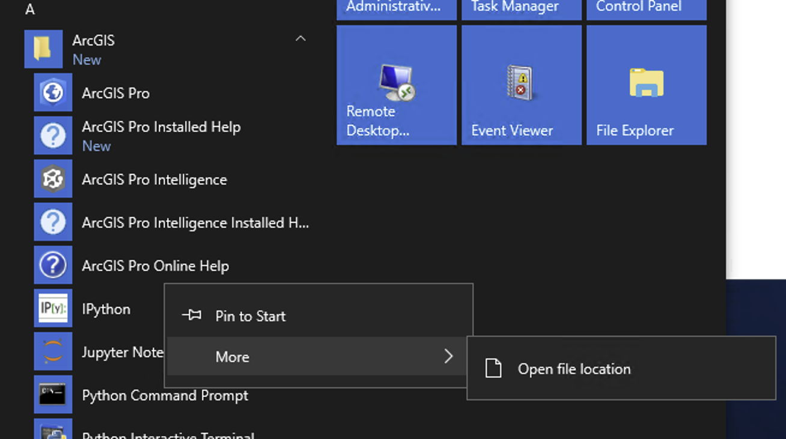
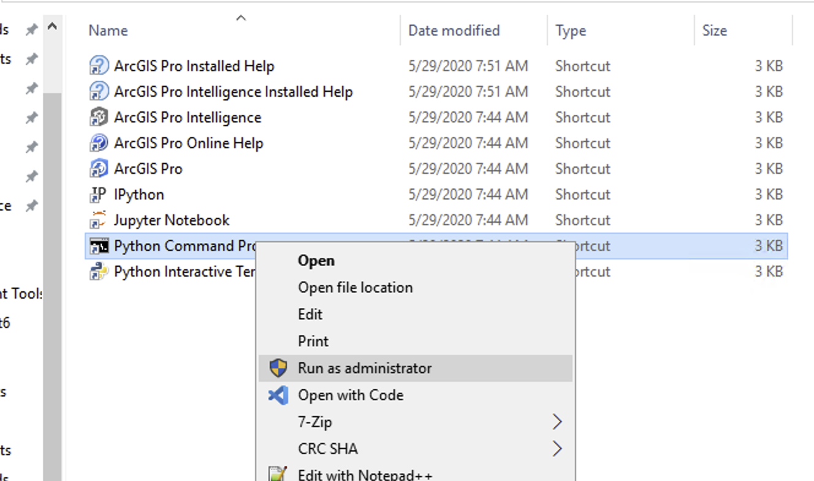
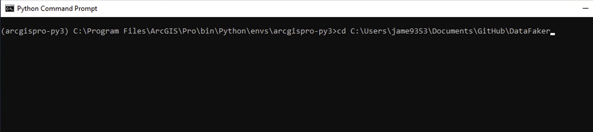
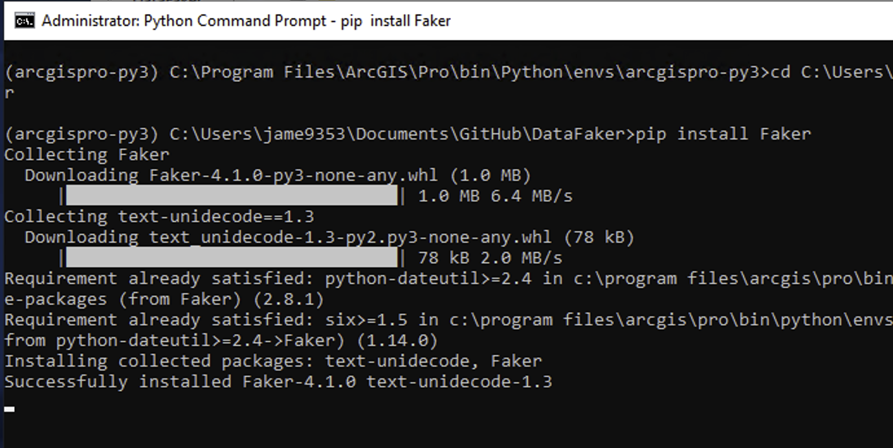
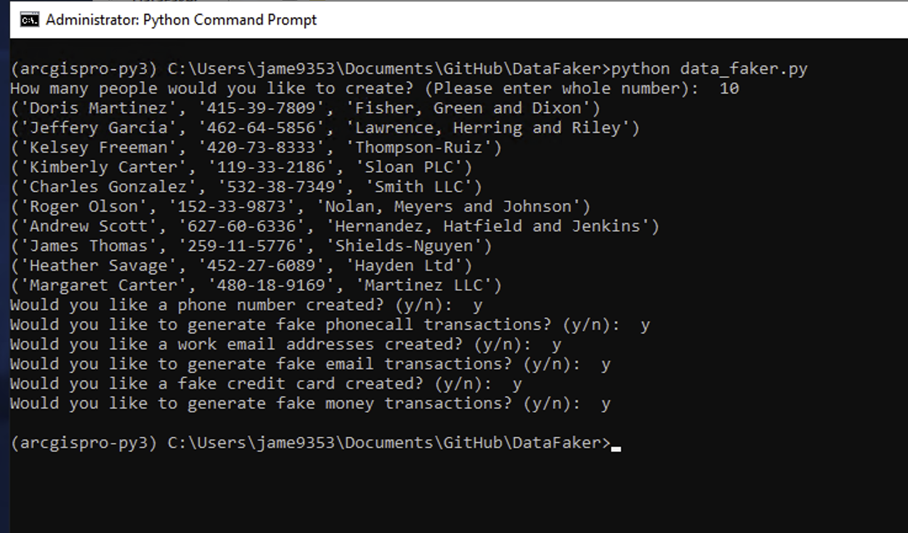

# DataFaker
A simple tool to help you fake some data for doing testing of Pro Intel.

## Setup instructions

- Open the python command prompt folder from the Start Menu => ArcGIS by right clicking on the Python Command Prompt => More => Open File Location

- In the folder that opens up, right click on Python Command Prompt and Select "Run as Administrator"

	
- Change directory into the folder containing data_faker.py.

- Run the following command in the Python Command Prompt
> pip install Faker

## Running the DataFaker

- In order to run DataFaker enter the following command:
> python data_faker.py

- Answer the questions that appear
- Data will be written to the directory where the DataFaker script is located.  